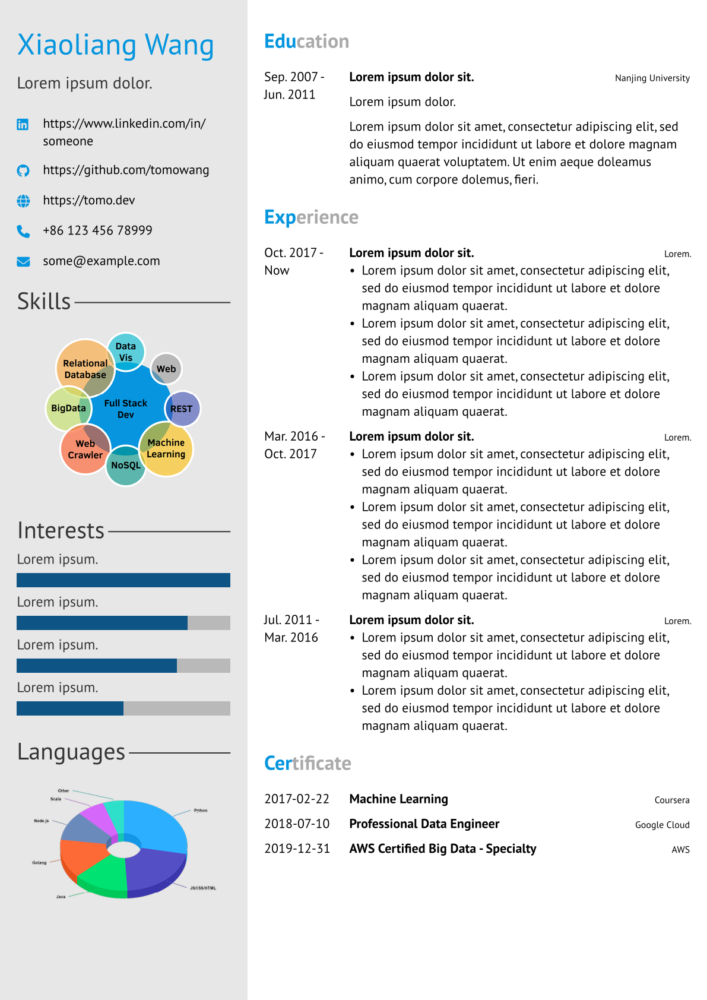

# Twenty Seconds CV/Resume in Typst

This Typst CV template is inspired by LaTeX template
[Twenty Seconds Resume/CV](https://www.latextemplates.com/template/twenty-seconds-resumecv).

## How to Use

This project has following files:

* `twentysecondcv.typ` - The Typst template file
* `example.typ` - The example resume
* `fonts` - Font awesome 6.4.2 For The Desktop. Downloaded from [https://fontawesome.com/download](https://fontawesome.com/download)

This template use Font Awesome for icons. You need to import the font awesome fonts
in your Typst project for the icons to show up properly. In macOS, just double
click the .otf font file to install.

> Note: If you use icon with dash sigh like `chess-queen`, it may not work properly.
> See https://github.com/typst/typst/issues/2578.
>
> You can use unicode instead. For example, `chess-queen` can be replaced with `"\u{f445}"`.
> You can find the unicode [here](https://github.com/typst/packages/blob/main/packages/preview/fontawesome/0.1.0/lib.typ)

Use `typst compile example.typ` to compile the example.typ into PDF.
This command will download `@preview/fontawesome:0.1.0` packge automatically.

If you want to use this template in [https://typst.app](https://typst.app),
just upload font awesome font files and `twentysecondcv.typ` template file.

You can see online example at [https://typst.app/project/rjQNvqRtLwNI1bfWz1iwKt](https://typst.app/project/rjQNvqRtLwNI1bfWz1iwKt)

## Todo

 - [ ] smartdiagram for skills
